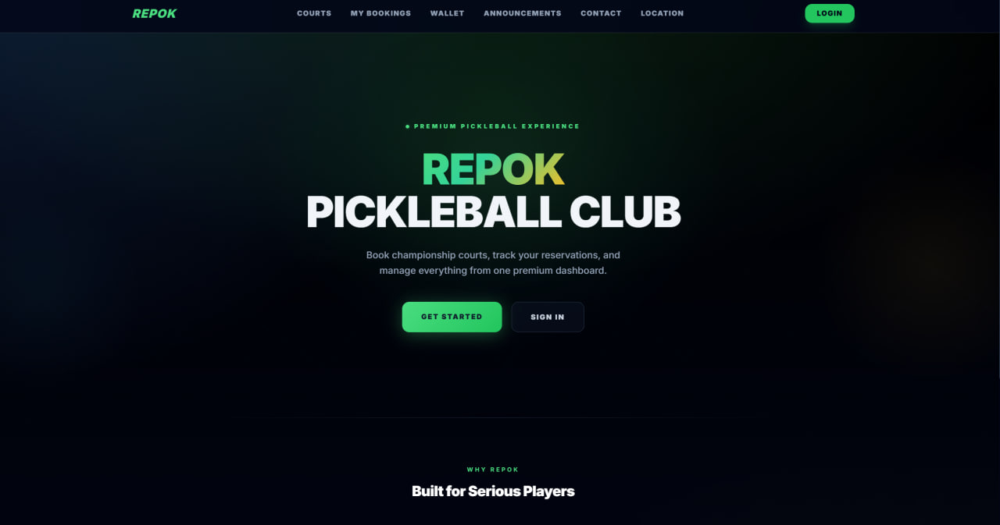
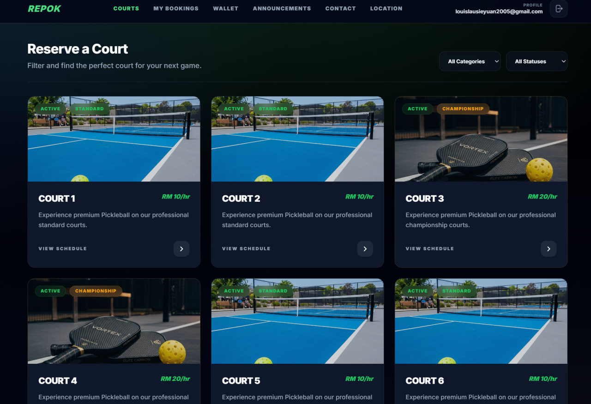
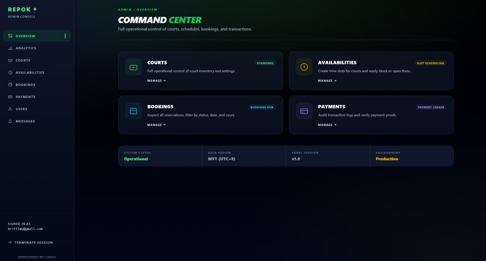

<h1 align="center">Hi, I'm Louis Lau Sie Yuan 👋</h1>

<h3 align="center">
Computer Science Student @ University of Malaya · Full-Stack Developer · Mobile / AI Developer
</h3>

<p align="center">
I build practical, demo-ready software products with clean UI, secure backend architecture, database-driven workflows, and real AI integration.
</p>

<p align="center">
  <a href="https://louis-portfolio-red.vercel.app">
    <strong>Portfolio</strong>
  </a>
  ·
  <a href="https://github.com/yuann1020">
    <strong>GitHub</strong>
  </a>
  ·
  <a href="https://www.linkedin.com/in/louis-lau-b64577401/">
    <strong>LinkedIn</strong>
  </a>
  ·
  <a href="mailto:louislausieyuan2005@gmail.com">
    <strong>Email</strong>
  </a>
</p>

---

## About Me

I'm a Year 2 Computer Science student at **University of Malaya (UM)** with a foundation background from **University of Technology Malaysia (UTM)**.

I enjoy turning ideas into working products. My focus is not only writing code, but building complete systems: frontend experience, backend logic, database structure, authentication, security, AI integration, and presentation-ready documentation.

```text
Current focus:
- Full-stack web development
- Mobile app development
- AI-powered product workflows
- Supabase / PostgreSQL backend systems
- Clean UI/UX for real demos
- Secure authentication and API architecture
```

---

## Tech Stack

### Frontend / Mobile


### Backend / Database


### AI / Tools


---

## Featured Projects

### 1. Repok Pickleball Court Booking System

> Full-stack sports venue booking and management platform for pickleball clubs.

Repok is a complete booking system that helps players browse courts, select time slots, manage bookings, and pay through wallet credit or manual QR upload. Administrators can manage courts, availability, payments, announcements, and revenue analytics.

**Role:** Solo Project  
**Tech Stack:** Next.js 14 · NestJS · TypeScript · Prisma · PostgreSQL · Supabase · Stripe · Tailwind CSS · React Query · Zustand

<div align="center">

<table>
  <tr>
    <td width="33%" align="center">
      
      <br />
      <sub><b>Landing Page</b></sub>
    </td>
    <td width="33%" align="center">
      
      <br />
      <sub><b>Court Booking Flow</b></sub>
    </td>
    <td width="33%" align="center">
      
      <br />
      <sub><b>Admin Dashboard</b></sub>
    </td>
  </tr>
</table>

</div>

**Highlights**
- Court browsing and real-time slot availability
- Consecutive time-slot booking workflow
- Booking hold timer and automatic expiry
- Wallet credit system with Stripe top-up
- Manual QR payment proof upload and admin approval
- Admin court management and payment review
- Analytics dashboard for revenue, bookings, utilization, and peak hours
- Email confirmation after successful booking payment

[Live Demo](https://repok-rpc.vercel.app/)  
[View Repository](https://github.com/yuann1020/Repok_PickleballCourtBookingSystem)

---

### 2. MochiMemo

> AI voice-first spending tracker for students and young professionals.

MochiMemo lets users record or type daily expenses naturally. It uses AI to transcribe voice, extract structured expense details, save user-owned data securely, and generate spending insights based on real monthly expenses.

**Role:** Solo Project  
**Tech Stack:** Expo React Native · TypeScript · Supabase Auth · Supabase Postgres · Supabase Edge Functions · OpenAI · React Query · Zustand

<div align="center">


<br />

<sub><b>MochiMemo mobile app hero preview</b></sub>

</div>

**Highlights**
- Voice expense logging
- AI transcription through server-side Edge Functions
- AI expense extraction with structured JSON output
- Review and edit before saving
- Daily spending history
- Editable monthly budget
- Home dashboard with category donut chart
- AI-generated spending insights and recommendations
- Supabase Row Level Security for per-user data protection
- Moon-glow glassmorphism mobile UI

[View Repository](https://github.com/yuann1020/MochiMemo)

---

### 3. F&B Genie

> AI-powered business feasibility investigator for Malaysian F&B MSMEs.

F&B Genie is a hackathon-built decision intelligence agent that helps small F&B owners evaluate business ideas before committing capital. It investigates competitors, calculates break-even points, assigns field tasks, and gives a GO / PIVOT / STOP verdict with risk analysis.

**Role:** Frontend + Backend  
**Project Type:** UMHackathon Group Project  
**Tech Stack:** Next.js · FastAPI · Firebase Auth · Firestore · Firebase Storage · Google Places API · Google Calendar API · Gemini · Tailwind CSS · Railway · Vercel

**Highlights**
- Business case creation workflow
- Interactive AI investigation workspace
- Live competitor scanning through Google Places
- Field task assignment for missing real-world data
- Evidence upload through Firebase Storage
- Two-pass AI analysis: generator + adversarial auditor
- GO / PIVOT / STOP verdict with confidence score
- Downloadable PDF feasibility report
- Full-stack deployment with Vercel and Railway

[Live App](https://fbgenie.vercel.app/login)  
[API Docs](https://umh2026-production.up.railway.app/docs)

---

## How I Build Projects

```txt
Idea
  ↓
User flow and core requirements
  ↓
Frontend prototype
  ↓
Backend/API design
  ↓
Database schema and security
  ↓
AI integration if useful
  ↓
Testing and polish
  ↓
README, demo video, and presentation
```

I like building projects that are:

| Principle | Meaning |
|---|---|
| Useful | Solves a real problem |
| Secure | Protects user data properly |
| Explainable | Easy to present and defend |
| Polished | Looks good enough for demo |
| Complete | Has frontend, backend, database, and documentation |

---

## Currently Learning

- Production-ready Supabase architecture
- Mobile app deployment with Expo
- AI app workflows with structured outputs
- Full-stack project documentation
- Better UI/UX for portfolio projects
- Secure authentication and authorization patterns

---

## Contact

- GitHub: [yuann1020](https://github.com/yuann1020)
- Email: [louislausieyuan2005@gmail.com](mailto:louislausieyuan2005@gmail.com)

---

<div align="center">

### Building practical full-stack and AI-powered products, one project at a time.

</div>
